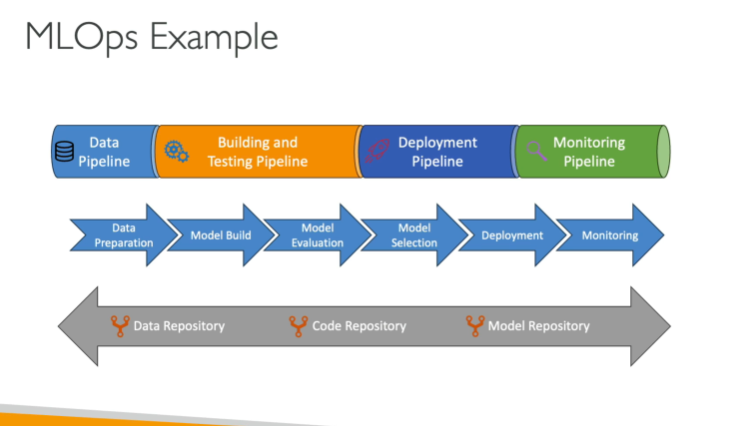

# MLOps

- We have to make sure models are not just developed but also deployed, monitored, retrained systematically and repeatedly
- MLOps is an extension of DevOps to deploy our code/models regularly
- Key principles:
    - Version control: data, code, mode could be rolled back if necessary
    - Automation of all stages including data ingestion, pre-processing, training, etc.
    - Continuous integration to test the models consistently
    - Continuous delivery to deploy the models in production
    - Continuous retraining
    - Continuous monitoring

