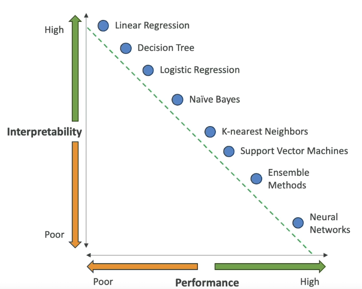

# Responsible AI and Security

- Responsible AI:
    - We want to make sure AI systems are transparent and trustworthy
    - We want to mitigate potential risks and negative outcomes
    - Throughout the AI lifecycle (design, development, deployment, monitoring, evaluation) we want to have responsible AI 
- Security:
    - We want to ensure that confidentiality, integrity and availability are maintained
    - This applies to organizational data and information assets and infrastructure
- Governance:
    - Ensures to add value and manage risks in the operation of a business
    - We need clear policies, guidelines and oversight mechanisms to ensure AI systems align with legal and regulatory requirements
    - The goal of it is to improve trust
- Compliance:
    - Ensures the adherence to regulations and guidelines for sensitive domains such as healthcare, finance and legal applications

## Core Dimensions of Responsible AI

- Fairness: promote inclusion and prevent discrimination
- Explainability
- Privacy and security: individuals control when and if their data is used
- Transparency
- Veracity and Robustness: our system should be reliable even in unexpected situations
- Governance: define, implement and enforce responsible AI practices
- Safety: we want to ensure our algorithms are safe and beneficial for individuals and society
- Controllability: ability to align to human values and intent

## AWS Services for Responsible AI

- Amazon Bedrock: offers human or automatic model evaluation
- Guardrails for Amazon Bedrock:
    - We can filter content, redact PII, enhance safety and privacy
    - We can block undesirable topics
    - We can filter harmful content
- SageMaker Clarify:
    - We have FML evaluation on accuracy, robustness and toxicity
    - Bias detection (example: detect skewed data towards certain gender)
- SageMaker Data Wrangler:
    - Can be used to fix bias by balancing data
    - Provides a functionality which can augment the data (generate new instances of data for underrepresented groups)
- SageMaker Model Monitor: does quality analysis of models running in production
- Amazon Augmented AI (A2I): offers human review of ML predictions
- Governance: SageMaker Role Manager, Model Cards (for documentation), Model Dashboard

## AWS AI Service Cards

- It is a form of responsible AI documentation that we can find on AWS site for certain managed models (such as Textract, Rekognition)
- It can help us understand the services and its features, intended use-cases and limitations, and responsible AI design choices
- Also offers information about deployment and performance best practices

## Interpretability Trade-Offs

- Interpretability:
    - It is the degree to which a human can understand the cause of a decision
    - We need access into the system so that a human can interpret the model's output to answer "why and how" questions
    - Models can have from very poor interpretability up to very high degree of interpretability
- For High transparency we need to have High Interpretability => we will mostly have poor performance

- Explainability:
    - Understand the nature and behavior of a machine learning model
    - With complex models we cannot fully understand how and why the inner mechanics impact the prediction
    - Through model agnostic methods (for example, partial dependence plots, SHapley Additive exPlanations (SHAP) dependence plots, or surrogate models) we can discover meaning between input data attributions and model outputs, which enables us to explain the nature and behavior of an ML model
    - Explainability can sometimes be enough

## Human-Centered Design (HCD) for Explainable AI

- Refers to the development of artificial intelligence (AI) technologies that prioritize human needs, values, and capabilities
- Design for amplified decision-making:
    - Minimize risk and errors in a stressful or high-pressure environments
    - Design for clarity, simplicity and usability
    - Design for reflexivity (reflect on decision-making process) and accountability
- Design for unbiased decision-making:
    - Decision process is free of bias
    - Train decision-makers to recognize and mitigate biases
- Design for human and AI learning:
    - Cognitive apprenticeship: AI systems learn from human instructors and experts
    - Personalization: meet the specific needs and preferences of a human learner
    - User-centered design: accessible to wide range of users